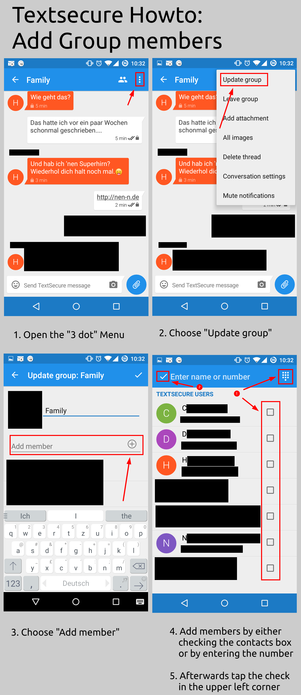

I had the big task of explaining my mother how to add members to a TextSecure group. As she's no IT native, she often forgets and tends to be slow on the uptake. That's why I created a picture howto for it. It's not polished in any way, but perhaps I can help someone who has met a similar challenge.

